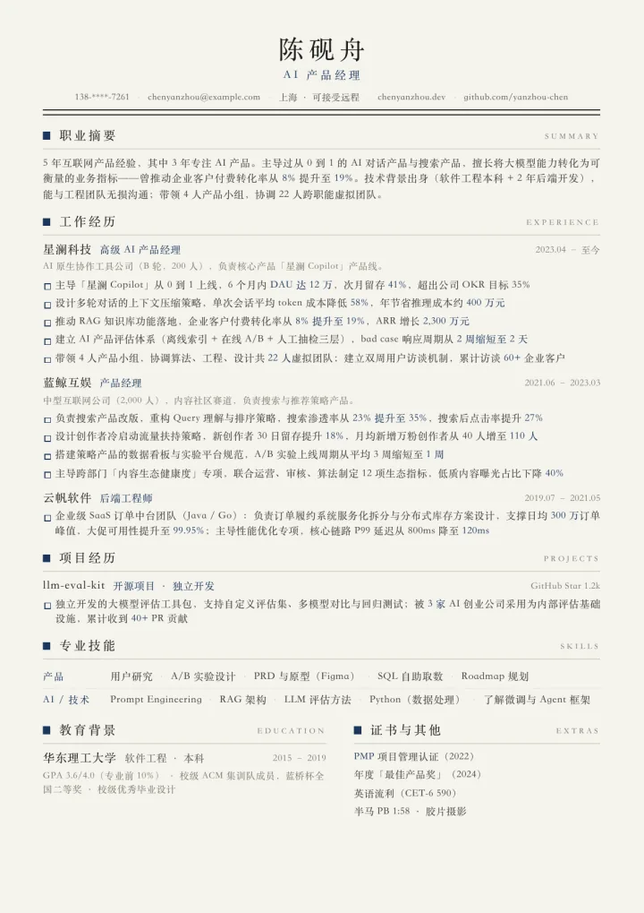
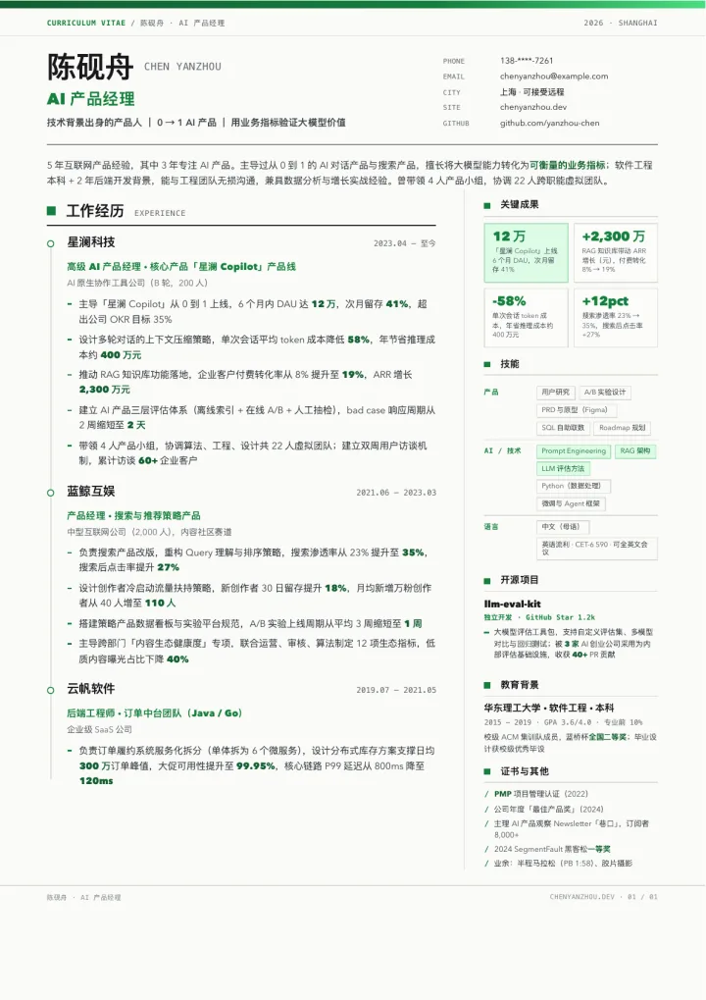
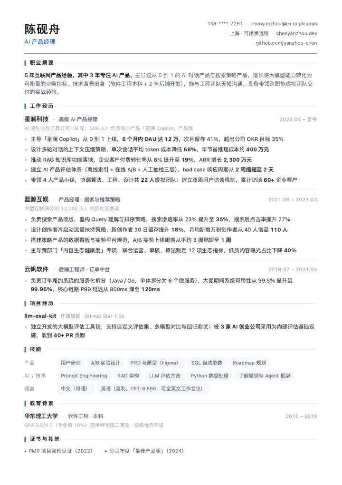
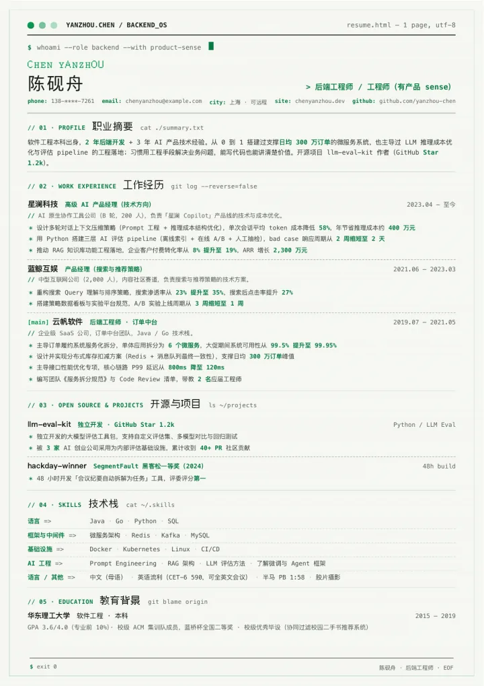
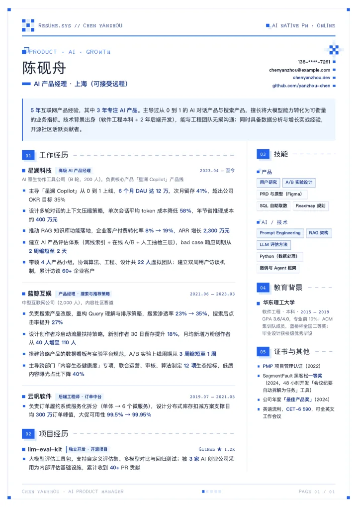
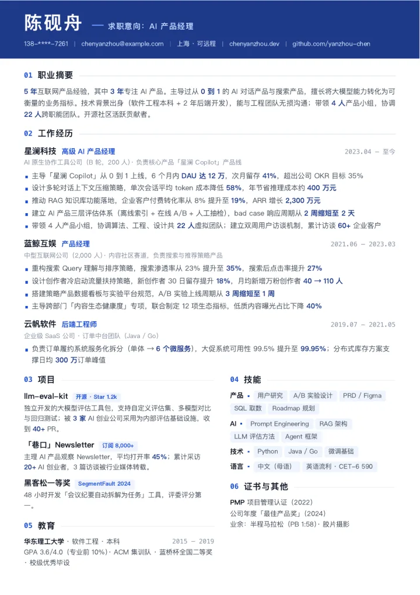
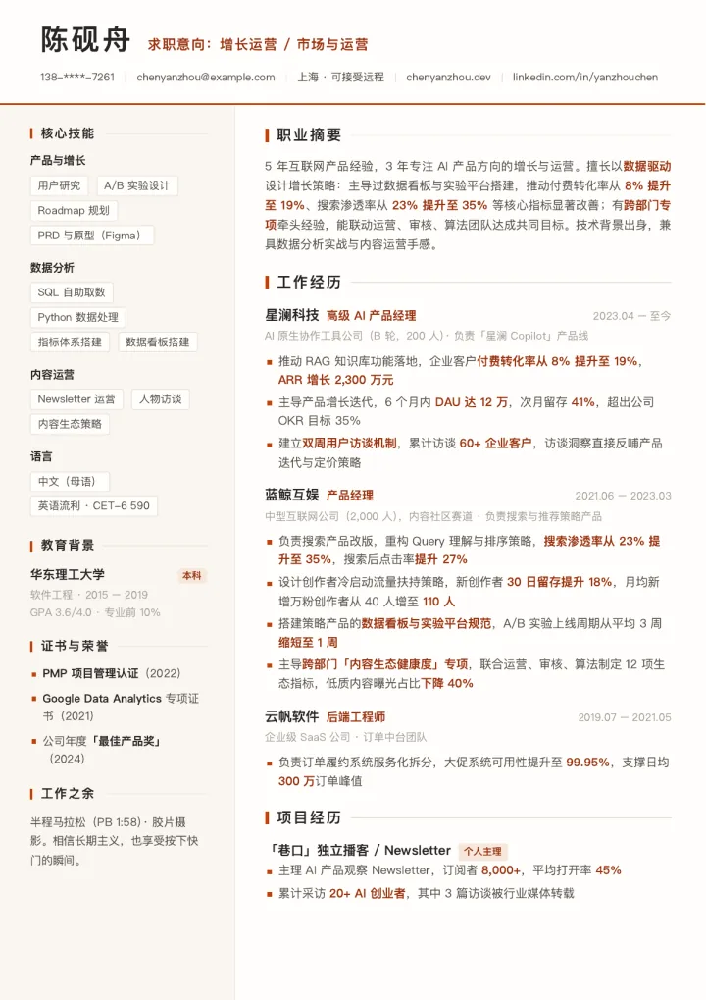
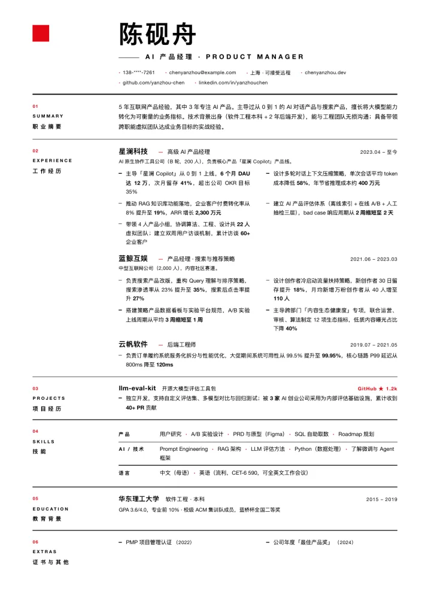
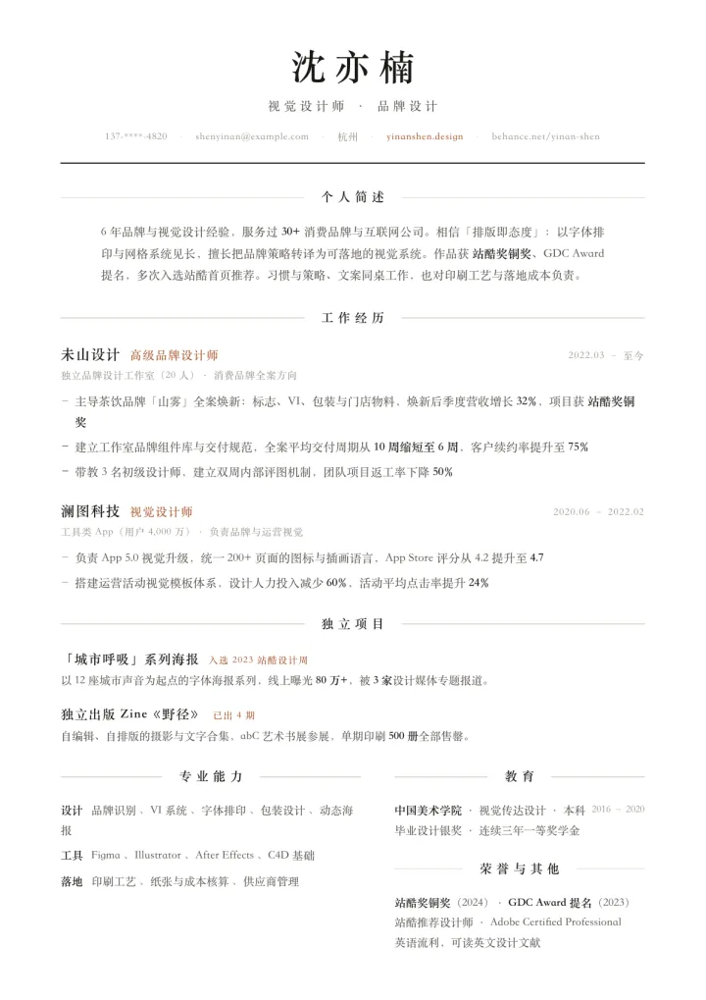
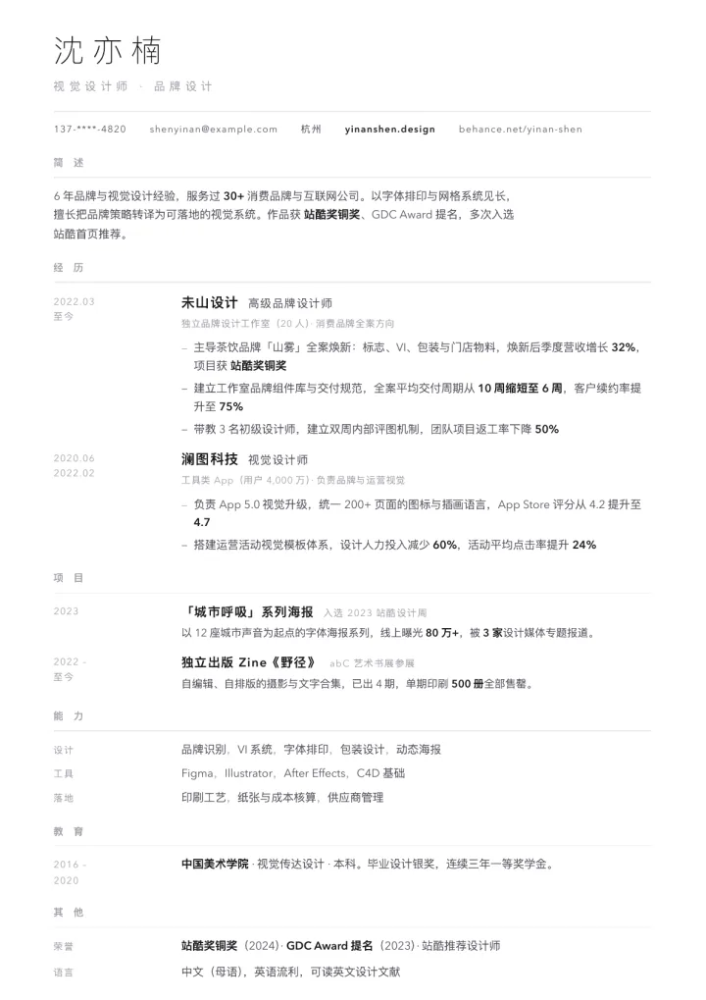

# Vincent Skills

[](https://skills.sh/vincent19951222/vincent-skills)
[](https://github.com/vincent19951222/vincent-skills/releases/latest)

这里是我分享的 Agent Skills 合集。每个 Skill 都是一个独立目录，包含 `SKILL.md`（触发条件与工作流）和配套资源文件，支持 Codex、Claude Code 等兼容 Agent Skills 的工具。

## 如何使用

推荐通过 [skills.sh](https://skills.sh/) 的 `skills` CLI 安装，无需预先全局安装 CLI：

```bash
# 查看仓库中的 Skills
npx skills add vincent19951222/vincent-skills --list

# 交互式选择并安装
npx skills add vincent19951222/vincent-skills

# 全局安装 resume-stylist 到 Codex
npx skills add vincent19951222/vincent-skills \
  --skill resume-stylist \
  --agent codex \
  --global

# 固定安装 resume-stylist v0.1.0
npx skills add 'vincent19951222/vincent-skills#v0.1.0' \
  --skill resume-stylist
```

常用维护命令：

```bash
# 更新全局安装的 resume-stylist
npx skills update resume-stylist --global --yes

# 查看 Codex 中的全局 Skills
npx skills list --global --agent codex

# 从 Codex 移除全局安装
npx skills remove resume-stylist --global --agent codex --yes
```

也可以把整个 Skill 目录手动复制到对应工具的 skills 目录，例如 Codex 的 `~/.codex/skills/` 或 Claude Code 的 `~/.claude/skills/`。

安装后，用自然语言描述需求（如“帮我做份简历”），Skill 会根据描述自动触发。

## Skills 列表

### 🖼️ codex-imagegen · Codex ImageGen 桥接器

让没有原生生图工具的 Claude Code 或其他兼容 Agent，通过本机临时 `codex exec` 会话调用 Codex 内建 ImageGen。复用现有 Codex ChatGPT 登录，不要求 `OPENAI_API_KEY`；支持单图生成、图片编辑、参考图和指定 PNG 输出路径。

```bash
npx skills add vincent19951222/vincent-skills --skill codex-imagegen
```

> 使用 $codex-imagegen 生成一张极简陶瓷咖啡杯的落地页主视觉，保存到项目的 assets/hero.png。

### 🎨 vincent-illustrations · Vincent 正文配图

把中文文章里的关键判断、流程、状态和隐喻转换成 16:9 极简线描概念草图。Skill 内置 Vincent 头像与线描角色板，会自动在 🗂️ 档案态和 💼 编辑态之间选择，以大量近白留白、冷静墨线、少量品牌点色，以及固定深板岩蓝外套与暖肤色，让 Vincent 亲自搬、接、拆、搭建或操作核心概念，而不是把头像当装饰。

[查看 Vincent 全身角色板](skills/vincent-illustrations/assets/vincent-character-sheet.png)

```bash
npx skills add vincent19951222/vincent-skills --skill vincent-illustrations
```

> 使用 $vincent-illustrations 为这篇中文文章规划并直接生成 4 张 Vincent IP 正文配图。

第一版聚焦 16:9 正文插图；3:4 小红书封面继续使用 `rednote-cover-gen`，头像转换使用 `artifact-template-warm-paper`。该 Skill 单独采用 CC BY-NC-SA 4.0，详细归属见其 `NOTICE.md`。

### 🕹️ vincent-pixel · Vincent 等距像素配图

把中文文章里的关键判断、流程和隐喻转换成 16:9 等距 16-bit 像素场景。支持文章封面和正文配图，使用清晰硬边像素、精准 2:1 等距几何、鲜明受控的调色板和温暖愉快的微缩工作室氛围，并让固定 Vincent 像素角色亲自完成核心动作。

```bash
npx skills add vincent19951222/vincent-skills --skill vincent-pixel
```

> 使用 $vincent-pixel 为这篇中文文章生成一张无字封面和 4 张正文配图，保留等距 16-bit 像素风格与 Vincent IP 一致性。

Midjourney 路径会追加 `--ar 16:9 --v 6.1 --style raw`；原生 ImageGen 会把同一要求转换为自然语言像素约束，不混用平台参数。

### 📝 format-knowledge-notes · 知识提炼与 Markdown 排版

将原始文本、会议记录、资料摘录、产品分析或已有 Markdown 提炼并排版为高信息密度、强结构、易扫描的知识笔记。支持整理笔记、提炼要点、压缩长文、去重重组，以及生成适合 Obsidian、Notion 或 GitHub README 的内容；也支持仅优化排版而不改写原文。

### 🎨 rednote-cover-gen · 小红书主角封面共创

根据标题、内容和可选主角生成一张竖版 3:4 小红书封面。默认先共同确认一个封面草案，再调用 ImageGen 生成；用户明确要求“不用确认、直接生成”时也支持快捷出图。

```bash
npx skills add vincent19951222/vincent-skills --skill rednote-cover-gen
```

> 使用 $rednote-cover-gen 和我一起做小红书封面。标题是“第一次做独立产品，我踩了这 5 个坑”，内容是个人复盘，主角交给你设计。

### 🖼️ artifact-template-warm-paper · Warm Paper 手绘头像

把人物参考照片转换为暖色纸张质感、细线稿与柔和水彩上色的正面半写实胸像，并保持模板的构图、配色和材质语言。[查看模板预览](skills/artifact-template-warm-paper/assets/preview.png)。

```bash
npx skills add vincent19951222/vincent-skills --skill artifact-template-warm-paper
```

> 使用 $artifact-template-warm-paper，把我上传的照片转换成 Warm Paper 手绘头像。

### 📄 resume-stylist · 简历风格生成器

根据**岗位方向**（产品 / 研发 / 职能 / 设计创意）与**目标公司性质**（传统 / 互联网 / AI native），生成匹配风格的单页 A4 HTML 与 PDF 简历。

#### 快速开始

```bash
npx skills add vincent19951222/vincent-skills --skill resume-stylist
```

有旧简历时，直接上传或粘贴内容，并告诉 Agent 目标岗位与公司：

> 使用 $resume-stylist 优化这份旧简历。我应聘 AI 产品经理，目标是 AI native B2B 创业公司。请先读取已有信息，一次列出真正缺失的必填项，不要编造数据；信息齐全后推荐 1–2 套风格。

从零开始时：

> 使用 $resume-stylist 从零制作一页中文简历。我应聘互联网后端研发，目前只有零散经历。请先给我标准信息表，我填写后再推荐风格。

只想换视觉风格时：

> 使用 $resume-stylist 把现有简历换成“瑞士极简”风格。除非我明确同意，不要改写或删减内容。

完整字段见[标准信息收集表](skills/resume-stylist/references/intake.md)。手机号、邮箱等隐私信息可以先使用脱敏占位符，最终交付前再替换。

对于新建或内容优化任务，Agent 会先给出事实清单、纯文本简历稿和改动说明；只有你明确确认后，才会生成最终文件。默认交付同名的自包含 HTML 和经过单页 A4 验证的 PDF。只换视觉且要求保留原文时可跳过内容确认。

**核心设计**：1 个内容骨架 + N 个视觉皮肤，两者正交——

- `references/skeleton.md`：语义化 HTML 契约 + bullet 写作规范（强动词 + 量化结果，拒绝"负责/参与"）
- `references/styles.md`：10 个皮肤的设计令牌与风格选择速查表
- `skins/`：10 个完整可用的皮肤实现，全部经过单页 A4 打印验证

| 皮肤 | 适合场景 |
|---|---|
| 经典纸质 | 传统 / 国企 / 事业单位 |
| 商务专业 | 传统大厂 / 外企 |
| 互联网简洁 | 互联网（最通用） |
| 工程师终端 | 研发岗位 |
| AI Pixel | AI native 公司 |
| AI 锋锐 | AI native / 产品 / 设计 |
| 暖调专业 | 市场 / 运营 / HR |
| 瑞士极简 | 外企 / 设计导向 |
| 杂志衬线 | 设计 / 艺术 / 内容 |
| 画廊极简 | 设计工作室 / 外企 / 创意团队 |

#### 模板预览

预览图放在仓库级 `examples/resume-stylist/`，不会进入安装后的 Skill。点击图片可查看完整 WebP：

| 经典纸质 | 商务专业 |
|---|---|
| [](examples/resume-stylist/01-classic-paper.webp) | [](examples/resume-stylist/02-enterprise.webp) |
| **互联网简洁** | **工程师终端** |
| [](examples/resume-stylist/03-internet-clean.webp) | [](examples/resume-stylist/04-terminal-engineer.webp) |
| **AI Pixel** | **AI 锋锐** |
| [](examples/resume-stylist/05-ai-pixel.webp) | [](examples/resume-stylist/06-ai-edge.webp) |
| **暖调专业** | **瑞士极简** |
| [](examples/resume-stylist/07-warm-modern.webp) | [](examples/resume-stylist/08-swiss-minimal.webp) |
| **杂志衬线** | **画廊极简** |
| [](examples/resume-stylist/09-editorial-serif.webp) | [](examples/resume-stylist/10-gallery-minimal.webp) |

皮肤中的“陈砚舟”和“沈亦楠”均为虚构示例人物，可直接打开 HTML 预览各风格效果。

#### 发布检查

维护者发布前可运行：

```bash
node skills/resume-stylist/scripts/regression.mjs
```

该命令会执行内容检查器自测、校验全部 10 套皮肤的 HTML 契约，并通过真实浏览器逐一生成和验证单页 A4 PDF；需要 Node.js、`npx` 与 Poppler。

## License

MIT
